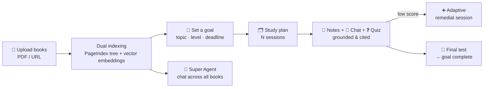

# 📚 Scholar — Goal-Driven AI Study System

**Upload your own textbooks, set a real deadline, and let Scholar build a personalized study plan — with AI notes, grounded chat, quizzes, and adaptive learning that are answered _only_ from your books.**

Scholar turns a pile of PDFs into a structured, deadline-aware course. Every note, every chat answer, and every quiz question is grounded in — and limited to — the specific sources you provide. No hallucinated facts from the open internet.

---

## ✨ What Scholar Does

A student uploads their course material, says _"I want to master this by the 30th,"_ and Scholar:

1. **Indexes the books** into a dual retrieval engine (structural + semantic).
2. **Builds a study plan** — a sequence of sessions sized to the deadline.
3. **Teaches each session** with streamed, cited notes and a grounded Q&A chat.
4. **Tests understanding** with quizzes, and **adapts** when the student struggles.
5. **Certifies mastery** with a cumulative final test that marks the goal complete.

---

## 🎯 Capabilities

| Capability | What it means for the student |
|------------|-------------------------------|
| **Bring your own books** | Upload PDFs or paste a URL — extraction and indexing are automatic. |
| **Goal-driven plans** | Set a topic, level, and deadline; Scholar generates a session-by-session plan. |
| **AI study notes** | Each session opens with concise, streamed markdown notes — every claim cited to a page. |
| **Grounded chat** | Ask anything; answers come _only_ from your books, with source citations. |
| **Quizzes + adaptive learning** | Auto-generated quizzes; a low score inserts a targeted remedial session automatically. |
| **Final cumulative test** | A cross-session exam that, when passed, marks the whole goal complete. |
| **Super Agent** | One chat that reasons across **all** your indexed books at once. |
| **Multimodal (optional)** | Opt-in understanding of diagrams and figures via a vision model. |
| **Notion export** | Push your plan and notes to a Notion page in one click. |
| **Model-agnostic** | Runs on OpenAI, Anthropic, Google, or any OpenAI-compatible model — all via `.env`. |

---

## 🔍 How It Works

At the core is a **dual retrieval engine** with two complementary strategies, selectable per query or pinned via config:

- **PageIndex** (structural) — an LLM navigates a hierarchical tree of the document and returns whole sections.
- **Vector** (semantic) — cosine similarity over embeddings returns the most relevant chunks.
- **Hybrid** — runs both and merges them.

→ Design details in **[docs/retrieval.md](docs/retrieval.md)**.

---

## 📊 Does it actually work?

The retrieval strategies are benchmarked head-to-head with **[RAGAS](https://docs.ragas.io)** on a 30-question golden set, using a bundled **Environmental Science** textbook as the evaluation book.

| Strategy | Faithfulness | Answer Relevancy | Context Precision |
|----------|:-----------:|:----------------:|:-----------------:|
| **PageIndex** | **0.94** | 0.81 | 0.77 |
| **Vector** | 0.85 | **0.91** | **0.92** |
| **Hybrid** | **0.94** | 0.90 | 0.90 |

A real trade-off — and **Hybrid gets the best of both**: it keeps PageIndex's grounding (faithfulness 0.94) while nearly matching Vector's precision (0.90). Full methodology, the evaluation book, and the complete comparison: **[docs/evaluation.md](docs/evaluation.md)**.

---

## 📖 Documentation

**Start here → [docs/README.md](docs/README.md)** — the documentation hub.

| Doc | Contents |
|-----|----------|
| [Architecture](docs/architecture.md) | Components, agent layer, storage model, request map |
| [Flows](docs/flows.md) | Diagrams: ingestion, retrieval, sessions, adaptive, final test, super agent |
| [Retrieval](docs/retrieval.md) | The dual engine — PageIndex vs vector, router, hybrid merge |
| [Evaluation](docs/evaluation.md) | RAGAS methodology, the eval book, results, reproduction |
| [Configuration](docs/configuration.md) | Full environment reference — running model-agnostically + selecting a strategy |

---

## 🧱 Tech at a Glance

**Backend** FastAPI · LangChain/LangGraph · PostgreSQL + pgvector · PageIndex (open-source, local) · RAGAS
**Frontend** Next.js 14 · TypeScript · Tailwind · native SSE streaming
**Models** Provider-agnostic via a model factory — OpenAI / Anthropic / Google / any OpenAI-compatible endpoint

A goal-driven study system with adaptive learning, multimodal ingestion, a cumulative final test, a cross-book Super Agent, and Notion export — backed by a benchmarked dual retrieval engine.
