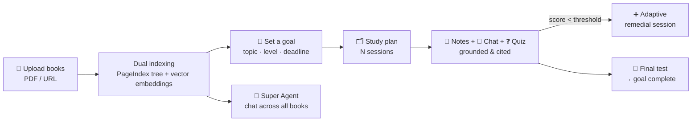

# 📚 Scholar — Goal-Driven AI Study System

**Upload your own textbooks, set a real deadline, and let Scholar build a personalized study plan — with AI notes, grounded chat, quizzes, and adaptive learning that are answered _only_ from your books.**

Scholar turns a pile of PDFs into a structured, deadline-aware course. Every note, every chat answer, and every quiz question is grounded in — and limited to — the specific sources you provide. No hallucinated facts from the open internet.

---

## ✨ What Scholar Does

A student uploads their actual course material, says _"I want to master this by the 30th,"_ and Scholar:

1. **Indexes the books** into a dual retrieval engine (structural + semantic).
2. **Builds a study plan** — a sequence of sessions sized to the deadline.
3. **Teaches each session** with streamed, cited notes and a grounded Q&A chat.
4. **Tests understanding** with quizzes, and **adapts** when the student struggles.
5. **Certifies mastery** with a cumulative final test that marks the goal complete.

---

## 🎯 Capabilities

| Capability | What it means for the student |
|------------|-------------------------------|
| **Bring your own books** | Upload PDFs or paste a URL — Scholar handles extraction and indexing automatically. |
| **Goal-driven plans** | Set a topic, level, and deadline; Scholar generates a session-by-session plan. |
| **AI study notes** | Each session opens with concise, markdown notes streamed live — every claim cited to a page. |
| **Grounded chat** | Ask anything about the material; answers come _only_ from your books, with source citations. |
| **Quizzes** | Auto-generated multiple-choice quizzes per session, scored instantly. |
| **Adaptive learning** | Score below the bar and Scholar inserts a targeted remedial session, automatically. |
| **Final cumulative test** | A cross-session exam that, when passed, marks the whole goal complete. |
| **Super Agent** | One chat that reasons across **all** your indexed books at once. |
| **Multimodal (optional)** | Opt-in understanding of diagrams and figures via a vision model. |
| **Notion export** | Push your plan and notes to a Notion page with one click. |
| **Model-agnostic** | Runs on OpenAI, Anthropic, Google, or any OpenAI-compatible local/hosted model — all via `.env`. |

---

## 🔍 How It Works (at a glance)



At the core is a **dual retrieval engine**: a **PageIndex** structural retriever (an LLM navigates a hierarchical tree of the document) and a **vector** semantic retriever (cosine similarity over embeddings). A lightweight router picks the right strategy per question — or blends both. See **[docs/retrieval.md](docs/retrieval.md)**.

---

## 📊 Does it actually work? (Evaluation)

Scholar's two retrieval strategies are benchmarked head-to-head with **[RAGAS](https://docs.ragas.io)** on a 30-question golden set generated to match the evaluation book.

> **Evaluation book:** a 58-page **Environmental Science** textbook (_"Environment and Agriculture"_) that ships ingested with the project. The original golden set targets OpenStax **Biology 2e** — supply that PDF to benchmark against it instead.

| Strategy | Faithfulness | Answer Relevancy | Context Precision | Latency |
|----------|:-----------:|:----------------:|:-----------------:|:-------:|
| **PageIndex** (structural) | **0.94** | 0.81 | 0.77 | 2480 ms |
| **Vector** (semantic) | 0.85 | **0.91** | **0.92** | 1780 ms |

A real trade-off: **PageIndex** keeps answers better grounded (larger structural sections), while **Vector** retrieves more precisely relevant context. Full methodology and how to reproduce: **[docs/evaluation.md](docs/evaluation.md)**.

---

## 🚀 Quick Start

```bash
# 1. Configure
cp .env.example .env
#   → set your provider keys (LLM_* and EMBEDDING_*). Any OpenAI-compatible model works.

# 2. Launch the full stack (Postgres+pgvector, FastAPI backend, Next.js frontend)
docker compose up

# 3. Open the app
#   Frontend  → http://localhost:3000
#   API docs  → http://localhost:8000/docs
```

Then: add a book on the **Knowledge** page → create a goal → start studying.

Full configuration (providers, models, vision, Notion, observability): **[docs/configuration.md](docs/configuration.md)**.

---

## 📖 Documentation

| Doc | Contents |
|-----|----------|
| **[docs/architecture.md](docs/architecture.md)** | System components, storage model, agent orchestration, request map |
| **[docs/flows.md](docs/flows.md)** | Sequence & state diagrams: ingestion, retrieval, session lifecycle, adaptive, final test, super agent |
| **[docs/retrieval.md](docs/retrieval.md)** | Dual retrieval engine design — PageIndex vs vector, router rules |
| **[docs/evaluation.md](docs/evaluation.md)** | RAGAS methodology, evaluation book, golden set, results, reproduction |
| **[docs/configuration.md](docs/configuration.md)** | Full env reference — model-agnostic provider setup |

---

## 🧱 Tech at a Glance

**Backend** FastAPI · LangChain/LangGraph (agent orchestration + checkpointing) · PostgreSQL + pgvector · PageIndex (open-source, local) · RAGAS (evaluation)
**Frontend** Next.js 14 (App Router) · TypeScript · Tailwind CSS · native SSE streaming
**Models** Provider-agnostic via a model factory — OpenAI / Anthropic / Google / any OpenAI-compatible endpoint (Ollama, Groq, Together, vLLM, …)

103 backend tests · GitHub Actions CI (pytest + ruff) on every PR.

---

## 📌 Status

- **v1.0** — Core study loop (ingestion, dual retrieval, planner, notes, chat, quiz, evaluation) ✅
- **v2.0** — Adaptive learning, multimodal ingestion, final-test agent, Super Agent, Notion export ✅
