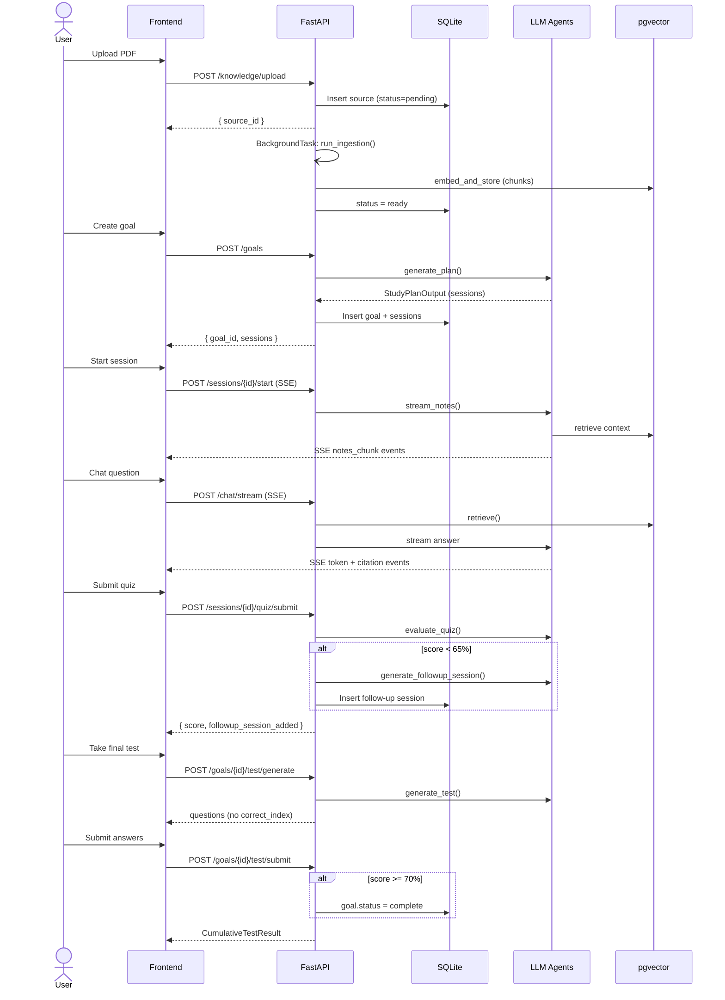
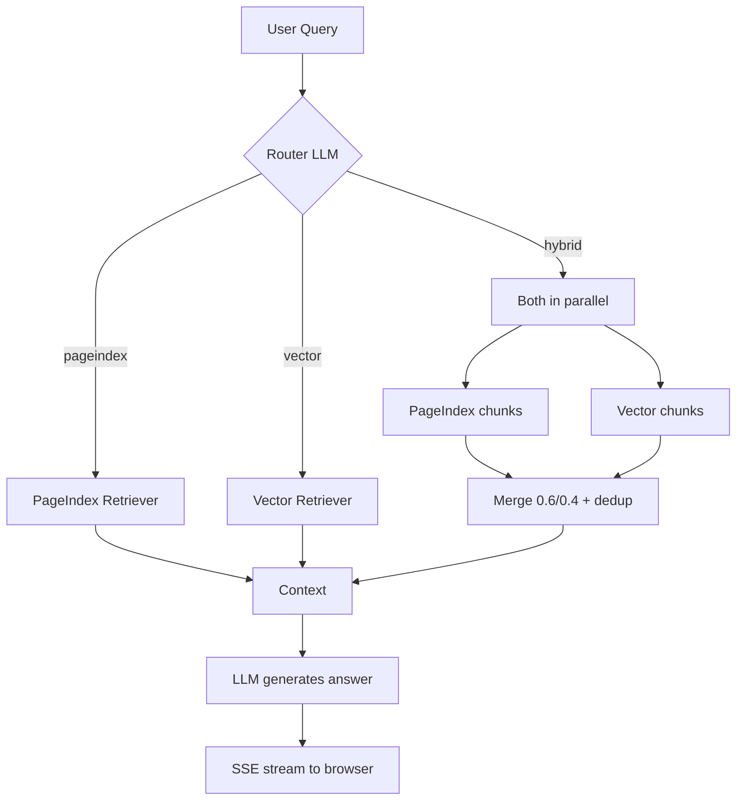

# Scholar — Goal-Driven AI Study System

**Turn any textbook or URL into a personalised, goal-driven study course.**

Scholar ingests your PDFs and web pages into a persistent knowledge base, then uses an AI planner to build a multi-session study plan. Each session streams grounded notes, answers follow-up questions with citations, and tests understanding with a quiz. V2 adds adaptive replanning, a final cumulative test, a cross-book super agent, and Notion export.

---

## Features

### V1 — Core Study Loop
| Feature | Description |
|---------|-------------|
| **Multi-format ingestion** | Upload PDF or URL → PageIndex tree + pgvector embeddings created automatically |
| **Dual retrieval engine** | Every query routed between PageIndex (structural) and vector RAG (semantic) |
| **Goal-driven planner** | LLM generates a sequenced multi-session study plan from your goal + deadline |
| **Streaming notes** | AI writes grounded session notes with textbook citations — streamed via SSE |
| **Grounded chat** | Ask follow-up questions; every answer cites the exact source page |
| **Quiz agent** | 5 MCQ questions per session grounded in your notes; score stored to progress |
| **Session checkpointing** | LangGraph + SQLite checkpointer — browser refresh restores session state |
| **LangSmith tracing** | Every agent call traced for cost, latency, and token usage |
| **RAGAS benchmark** | PageIndex vs vector RAG evaluated on 30 Q&A pairs |

### V2 — Adaptive Learning + Super Agent
| Feature | Description |
|---------|-------------|
| **Adaptive replanning** | Quiz score < 65 % → follow-up session automatically inserted into the plan |
| **Final cumulative test** | After all sessions complete: cross-session MCQ test → goal marked `complete` on pass |
| **Super Agent** | Chat across your entire knowledge base (all books combined) at `/super` |
| **Vision ingestion** | Diagram/chart descriptions extracted from PDFs via a vision LLM (opt-in) |
| **Notion export** | Export study plan + session notes to Notion as a background task |
| **GitHub Actions CI** | `pytest` + `ruff` on every PR; live-LLM tests excluded via marker |

---

## Quick Start

```bash
# 1. Clone and configure
git clone https://github.com/Hafiz408/scholar.git
cd scholar
cp backend/.env.example backend/.env
# Edit .env — fill in LLM_API_KEY and EMBEDDING_API_KEY at minimum

# 2. Start the stack
docker compose up

# 3. Open the app
open http://localhost:3000
```

| Service | URL |
|---------|-----|
| Frontend | http://localhost:3000 |
| Backend API | http://localhost:8000 |
| Swagger docs | http://localhost:8000/docs |

---

## Configuration

Copy `backend/.env.example` to `backend/.env` and fill in the values you need:

```env
# ── LLM ──────────────────────────────────────
LLM_PROVIDER=openai               # openai | openai-compat | anthropic | google
LLM_API_KEY=sk-...
LLM_MODEL=gpt-4o-mini
LLM_BASE_URL=                     # empty = OpenAI; set for Mistral / Ollama / Groq

# ── Embeddings ───────────────────────────────
EMBEDDING_API_KEY=sk-...
EMBEDDING_MODEL=text-embedding-3-small
EMBEDDING_DIMENSIONS=1536
EMBEDDING_BASE_URL=               # empty = OpenAI-compatible default

# ── Vision (V2, optional) ────────────────────
VISION_MODEL=                     # empty = disabled; set e.g. "gpt-4o" to enable
VISION_MAX_PAGES=20               # cost guard: max pages per document

# ── Notion export (V2, optional) ─────────────
NOTION_API_KEY=secret_...
NOTION_PARENT_PAGE_ID=abc123...

# ── Observability ────────────────────────────
LANGSMITH_API_KEY=ls__...         # optional; enables LangSmith tracing if set
```

> PageIndex uses the same `LLM_*` settings — no separate key needed.

---

## Architecture

```
┌─────────────────────────────────────────────────────────────┐
│                       Next.js 14 Frontend                   │
│  /knowledge  /goals/[id]  /study/[sessionId]  /super        │
└───────────────────────────┬─────────────────────────────────┘
                            │  REST + SSE
┌───────────────────────────▼─────────────────────────────────┐
│                       FastAPI Backend                        │
│                                                             │
│  ┌──────────────┐  ┌──────────────┐  ┌────────────────────┐│
│  │  Ingestion   │  │  Retrieval   │  │       Agents       ││
│  │  Pipeline    │  │  Engine      │  │                    ││
│  │              │  │              │  │  Planner           ││
│  │  pdf extract │  │  Router LLM  │  │  Note Generator    ││
│  │  url extract │  │      ↓       │  │  Session Chat      ││
│  │  vision OCR  │  │  PageIndex   │  │  Quiz Agent        ││
│  │  PageIndex   │  │  Vector RAG  │  │  Adaptive Planner  ││
│  │  pgvector    │  │  Hybrid 0.6/0│  │  Test Agent        ││
│  └──────┬───────┘  └──────┬───────┘  │  Super Agent       ││
│         │                 │          │  Notion MCP        ││
│         └─────────────────┘          └────────────────────┘│
│                                                             │
│  ┌──────────────────────┐  ┌──────────────────────────────┐│
│  │  SQLite              │  │  PostgreSQL + pgvector       ││
│  │  goals / sessions    │  │  knowledge_chunks (vectors)  ││
│  │  chat history        │  │                              ││
│  │  cumulative tests    │  └──────────────────────────────┘│
│  │  LangGraph state     │                                  ││
│  └──────────────────────┘                                  │
└─────────────────────────────────────────────────────────────┘
```

### Dual Retrieval Engine

Every query is classified by a Router LLM agent and dispatched to the best strategy:

| Strategy | Mechanism | Best for |
|----------|-----------|---------|
| **PageIndex** | LLM navigates a hierarchical JSON tree of the book | Chapter/section questions, structural navigation |
| **Vector RAG** | Cosine similarity over pgvector embeddings | Factual lookups, broad semantic search |
| **Hybrid** | Both concurrently, merged at `0.6 × pageindex + 0.4 × vector` | Complex questions needing depth and breadth |

If no PageIndex tree exists for a source, the router falls back to vector automatically.

---

## End-to-End User Flow



---

## Retrieval Strategy Flow



---

## Tech Stack

| Layer | Technology |
|-------|-----------|
| Backend framework | FastAPI 0.115 |
| Agent orchestration | LangChain 0.3 + LangGraph 0.2 |
| Observability | LangSmith |
| Document tree | PageIndex (open-source, local) |
| Vector store | PostgreSQL 16 + pgvector |
| PDF extraction | pdfplumber + pypdf |
| URL extraction | trafilatura |
| Vision extraction | PyMuPDF + vision LLM (opt-in) |
| LLM providers | OpenAI / Mistral / Anthropic / Google (via factory) |
| Session state | LangGraph AsyncSqliteSaver |
| Frontend | Next.js 14 + TypeScript + Tailwind CSS |
| CI | GitHub Actions |
| Evaluation | RAGAS |

---

## Test Suite

```bash
# Run all automated tests (inside Docker)
docker compose exec backend pytest tests/ -m "not integration" -v

# Or locally (activate venv first)
cd backend && pytest tests/ -m "not integration" -v
```

**103 tests pass.** The single excluded test (`test_router_accuracy_gate`) requires a live LLM API key and is marked `@pytest.mark.integration`.

---

## RAGAS Benchmark

PageIndex vs vector RAG evaluated on 30 Q&A pairs (OpenAI judge, full ingestion):

| Strategy | Faithfulness | Answer Relevancy | Context Precision | Avg Latency |
|----------|-------------|-----------------|-------------------|-------------|
| PageIndex | 0.89 | 0.00† | 0.00† | 2578ms |
| Vector | 0.94 | 0.02† | 0.02† | 1920ms |

**Faithfulness** (how well answers stay grounded in retrieved context) is now measured with a live OpenAI judge — both strategies score highly (0.89–0.94), up from an earlier 0.64/0.54 run.

† Answer Relevancy and Context Precision are near-zero here because the committed `golden_qa.json` targets **Biology 2e**, while the benchmark ran against `Test book.pdf` (a different subject) — the reference answers don't match the book. For representative relevancy/precision, ingest Biology 2e (or regenerate `golden_qa.json` to match your book) and re-run.

Results committed to `backend/eval/results/`. Re-run:
```bash
docker compose exec backend python eval/run_ragas.py \
  --book-path /app/data/uploads/your-book.pdf \
  --output-dir eval/results/
```

---

## Project Structure

```
scholar/
├── backend/               # FastAPI app, agents, ingestion, retrieval, tests
│   ├── app/
│   │   ├── agents/        # Planner, NoteGenerator, Chat, Quiz, Adaptive, Test, Super, Notion
│   │   ├── ingestion/     # pdf_extractor, url_extractor, vision_extractor, embedder, pipeline
│   │   ├── retrieval/     # router, pageindex_retriever, vector_retriever, hybrid_retriever
│   │   ├── routers/       # FastAPI routes: knowledge, goals, sessions, chat, quiz, test, super
│   │   ├── models/        # Pydantic schemas
│   │   ├── db/            # SQLite + pgvector schema init
│   │   ├── config.py      # Pydantic settings
│   │   ├── llm_factory.py # Provider-agnostic LLM factory (chat + vision)
│   │   └── main.py        # App startup, lifespan, router registration
│   ├── eval/              # golden_qa.json + RAGAS runner + results/
│   └── tests/             # pytest suite (93 tests)
├── frontend/              # Next.js 14 app
│   └── src/
│       ├── app/           # Pages: knowledge, goals, study, super
│       ├── components/    # UI components including V2: AdaptiveAlert, TestPanel, NotionExportButton
│       └── lib/           # api.ts, sse.ts helpers
├── docs/                  # architecture.md
├── .github/workflows/     # ci.yml — pytest + ruff on PRs
└── docker-compose.yml
```

See subdirectory READMEs for detailed design:
- [`backend/README.md`](backend/README.md) — API reference, agent descriptions, DB schema
- [`frontend/README.md`](frontend/README.md) — pages, components, SSE streaming pattern
- [`backend/eval/README.md`](backend/eval/README.md) — RAGAS evaluation guide
- [`backend/tests/README.md`](backend/tests/README.md) — test strategy and coverage map
