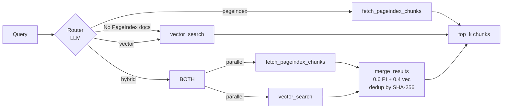
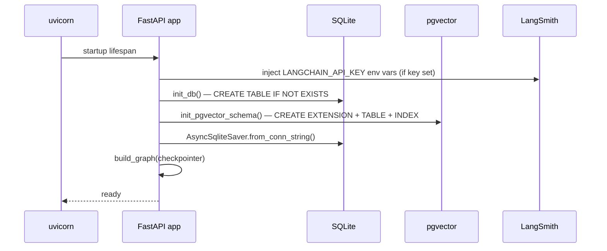

# Backend — Scholar API

FastAPI backend for Scholar. Handles ingestion, retrieval, all AI agents, and REST + SSE endpoints.

---

## Quick Start

```bash
cd backend
cp .env.example .env        # fill in LLM_API_KEY, EMBEDDING_API_KEY
pip install -r requirements.txt
uvicorn app.main:app --reload
```

Or via Docker Compose from the repo root:
```bash
docker compose up backend
```

API base: `http://localhost:8000`
Swagger UI: `http://localhost:8000/docs`

---

## Configuration (`app/config.py`)

All settings are loaded from `.env` via Pydantic `BaseSettings`. Every field has a safe default — only `LLM_API_KEY` and `EMBEDDING_API_KEY` are required at runtime.

| Variable | Default | Description |
|----------|---------|-------------|
| `LLM_PROVIDER` | `openai` | `openai` \| `openai-compat` \| `anthropic` \| `google` |
| `LLM_API_KEY` | — | API key for the chosen LLM provider |
| `LLM_MODEL` | `gpt-4o-mini` | Chat model name |
| `LLM_BASE_URL` | — | Override endpoint (Mistral, Ollama, Groq…) |
| `EMBEDDING_API_KEY` | — | Embedding provider key |
| `EMBEDDING_MODEL` | `text-embedding-3-small` | Embedding model |
| `EMBEDDING_DIMENSIONS` | `1536` | Must match the model |
| `EMBEDDING_BASE_URL` | — | Override embedding endpoint |
| `VISION_MODEL` | *(empty)* | Vision LLM — empty disables vision extraction |
| `VISION_MAX_PAGES` | `20` | Max pages per document for vision extraction |
| `NOTION_API_KEY` | *(empty)* | Notion integration token |
| `NOTION_PARENT_PAGE_ID` | *(empty)* | Notion page to create exports under |
| `LANGSMITH_API_KEY` | *(empty)* | LangSmith key — tracing enabled when set |
| `DATABASE_URL` | `postgresql://...` | PostgreSQL connection string |
| `SQLITE_PATH` | `./data/scholar.db` | SQLite file for goals/sessions/state |
| `UPLOAD_DIR` | `./data/uploads` | Uploaded PDF storage |

---

## API Endpoints

### Knowledge Base

| Method | Path | Description |
|--------|------|-------------|
| `POST` | `/knowledge/upload` | Upload PDF (multipart) or URL → background ingestion |
| `GET` | `/knowledge` | List all knowledge sources |
| `GET` | `/knowledge/{id}/status` | Poll ingestion status |
| `DELETE` | `/knowledge/{id}` | Remove source (pgvector + PageIndex + SQLite) |

### Goals & Sessions

| Method | Path | Description |
|--------|------|-------------|
| `POST` | `/goals` | Create goal → invoke Planner → return session plan |
| `GET` | `/goals/{id}` | Fetch goal with all sessions and statuses |
| `POST` | `/goals/{id}/adapt` | Manual adaptive replanning for weak sessions |
| `POST` | `/goals/{id}/export/notion` | Start background Notion export |
| `POST` | `/sessions/{id}/start` | Mark in_progress; stream notes as SSE |
| `POST` | `/sessions/{id}/complete` | Mark session complete |

### Quiz

| Method | Path | Description |
|--------|------|-------------|
| `POST` | `/sessions/{id}/quiz/generate` | Generate 5 MCQs (correct_index withheld) |
| `POST` | `/sessions/{id}/quiz/submit` | Score answers; trigger adaptive planner if score < 65 % |

### Final Cumulative Test (V2)

| Method | Path | Description |
|--------|------|-------------|
| `POST` | `/goals/{id}/test/generate` | Generate cross-session test (400 if sessions incomplete) |
| `POST` | `/goals/{id}/test/submit` | Score; mark goal complete if ≥ 70 % |

### Chat

| Method | Path | Description |
|--------|------|-------------|
| `POST` | `/chat/stream` | Session-scoped SSE chat |
| `POST` | `/super/chat/stream` | Cross-KB SSE chat (all ready sources) |

### System

| Method | Path | Description |
|--------|------|-------------|
| `GET` | `/health` | Status + pgvector extension check |

---

## Directory Structure

```
backend/
├── app/
│   ├── main.py              # FastAPI app, lifespan, router registration
│   ├── config.py            # Pydantic settings (all env vars)
│   ├── llm_factory.py       # Provider-agnostic get_llm() + get_vision_llm()
│   ├── database.py          # SQLAlchemy engine helper
│   ├── agents/
│   │   ├── orchestrator.py  # ScholarState, build_graph(), create_goal_with_plan()
│   │   ├── planner.py       # Planner agent — StudyPlanOutput
│   │   ├── note_generator.py# Streaming notes via SSE
│   │   ├── session_chat.py  # Grounded session chat
│   │   ├── quiz_agent.py    # Generate + evaluate MCQs
│   │   ├── adaptive_planner.py  # V2: remediation session insertion
│   │   ├── test_agent.py    # V2: final cumulative test generator + scorer
│   │   ├── super_agent.py   # V2: cross-source chat agent
│   │   ├── notion_mcp.py    # V2: Notion API export
│   │   └── prompts.py       # All LLM system/user prompt constants
│   ├── ingestion/
│   │   ├── pipeline.py      # 5-stage orchestrator (BackgroundTask)
│   │   ├── pdf_extractor.py # pdfplumber + pypdf page extraction
│   │   ├── url_extractor.py # trafilatura web extraction
│   │   ├── vision_extractor.py # V2: diagram/chart descriptions via vision LLM
│   │   ├── pageindex_builder.py # PageIndex tree construction
│   │   └── embedder.py      # Chunk + embed + upsert into pgvector
│   ├── retrieval/
│   │   ├── router.py        # LLM classifies query → strategy
│   │   ├── pageindex_retriever.py # Fetch chunks from PageIndex tree
│   │   ├── vector_retriever.py    # pgvector cosine similarity search
│   │   └── hybrid_retriever.py   # Weighted fusion + dedup + orchestration
│   ├── routers/
│   │   ├── knowledge.py     # /knowledge/* endpoints
│   │   ├── goals.py         # /goals/* endpoints
│   │   ├── sessions.py      # /sessions/*/start + complete
│   │   ├── chat.py          # /chat/stream SSE
│   │   ├── quiz.py          # /sessions/*/quiz/*
│   │   ├── test.py          # /goals/*/test/* (V2)
│   │   └── super.py         # /super/chat/stream (V2)
│   ├── models/
│   │   └── schemas.py       # Pydantic data models
│   └── db/
│       └── database.py      # init_db() SQLite + init_pgvector_schema()
├── eval/                    # RAGAS evaluation — see eval/README.md
├── tests/                   # pytest suite — see tests/README.md
├── requirements.txt
└── Dockerfile
```

---

## LLM Factory (`app/llm_factory.py`)

Centralised factory — never import `ChatOpenAI` or any provider class directly in agents.

```python
from app.llm_factory import get_llm, get_vision_llm

llm = get_llm(temperature=0)                # chat model
vision_llm = get_vision_llm()              # vision model (raises if VISION_MODEL empty)
```

**Supported providers** (set `LLM_PROVIDER`):

| Value | SDK used |
|-------|---------|
| `openai` | `langchain-openai` |
| `openai-compat` | `langchain-openai` + custom `base_url` |
| `anthropic` | `langchain-anthropic` (install separately) |
| `google` | `langchain-google-genai` (install separately) |

---

## Agents

### Planner (`agents/planner.py`)
Generates a sequenced `StudyPlanOutput` from goal metadata. Uses `deadline_days × sessions_per_week / 7` to calculate session count. Output is structured via `with_structured_output(StudyPlanOutput)`.

### Note Generator (`agents/note_generator.py`)
Retrieves context via `hybrid_retriever.retrieve()` then streams markdown notes via SSE `notes_chunk` events. Every factual claim includes a `[Source: Title, p.N]` citation.

### Session Chat (`agents/session_chat.py`)
Re-retrieves on every message. Chat history persisted via LangGraph `AsyncSqliteSaver`. System prompt enforces "only answer from provided context".

### Quiz Agent (`agents/quiz_agent.py`)
Generates 5 MCQs from session notes + retrieved context. `correct_index` stored in SQLite, never sent to frontend. `evaluate_quiz()` scores answers and returns per-question explanations.

### Adaptive Planner — V2 (`agents/adaptive_planner.py`)
Called after quiz scoring. If `score < 0.65`:
1. Generates a remediation session via LLM
2. Atomically renumbers all downstream sessions
3. Inserts new follow-up at `original_session_number + 1`

Wrapped in `try/except` — never blocks the quiz response.

### Test Agent — V2 (`agents/test_agent.py`)
Generates 1–2 MCQ questions per completed session (cap 15 total). Uses `hybrid_retriever` for per-session context. Scores answers and marks `study_goals.status = 'complete'` if `score ≥ 0.70`.

### Super Agent — V2 (`agents/super_agent.py`)
Queries **all** `status='ready'` sources (not scoped to any goal). Uses the caller-supplied `thread_id` (from browser `localStorage`) as the LangGraph checkpoint key for persistent cross-session chat history.

### Notion MCP — V2 (`agents/notion_mcp.py`)
Exports goal + session notes to Notion API as a `BackgroundTask`. Creates one parent page per goal and one child page per session with notes. Exponential backoff (1s, 2s, 4s) on HTTP 429.

---

## Ingestion Pipeline

5-stage pipeline run as a FastAPI `BackgroundTask`:

```mermaid
sequenceDiagram
    participant API as FastAPI
    participant DB as SQLite
    participant EXT as Extractor
    participant VIS as Vision LLM
    participant PI as PageIndex
    participant PG as pgvector

    API->>DB: INSERT source (status=pending)
    API-)API: BackgroundTask: run_ingestion()
    EXT->>EXT: extract_pdf() / extract_url()
    opt VISION_MODEL set and PDF has image pages
        VIS->>VIS: augment_pages_with_vision()
        Note over VIS: Adds visual descriptions<br/>to page text; never blocks
    end
    API->>DB: status = indexing_pageindex
    PI->>PI: build_pageindex_tree()
    Note over PI: Returns None on failure<br/>(vector-only fallback)
    API->>DB: status = indexing_vectors
    PG->>PG: embed_and_store() (chunks, upsert)
    API->>DB: status = ready, pageindex_doc_id = ?
```

**Failure modes:**
- PageIndex fails → `pageindex_doc_id = NULL`, status `ready` (vector fallback)
- Both fail → status `failed`
- Vision fails → page ingested without visual descriptions (never blocks)

---

## Retrieval Engine



**Router fallback rule:** If no source has a `pageindex_doc_id`, the LLM call is skipped and `vector` is returned immediately.

---

## Database Schema

### SQLite (LangGraph state + application data)

```sql
knowledge_sources   -- uploaded books/URLs and ingestion status
study_goals         -- user goals with deadline and level
study_sessions      -- individual sessions within a goal
chat_history        -- per-session conversation turns
quiz_questions      -- generated MCQs with correct_index
cumulative_tests    -- V2: cross-session test results
```

### PostgreSQL + pgvector (vector embeddings)

```sql
knowledge_chunks    -- text chunks with embedding vector(N)
                    -- indexed with ivfflat cosine_ops
```

---

## Startup Sequence



---

## Running Tests

```bash
# CI-equivalent (no live APIs needed)
pytest tests/ -m "not integration" -v

# All tests including accuracy gate (requires LLM_API_KEY)
pytest tests/ -v
```

See [`tests/README.md`](tests/README.md) for full coverage map.
