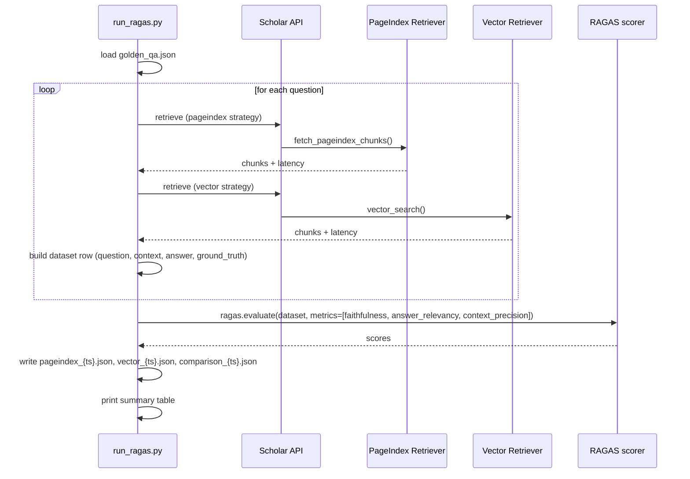

# Evaluation — RAGAS Benchmark

Head-to-head evaluation of PageIndex vs vector RAG on a 30-question golden dataset derived from an academic textbook.

---

## Overview

Scholar uses two retrieval strategies — PageIndex (structural, LLM-navigated tree) and pgvector (semantic embeddings). The RAGAS benchmark measures which strategy produces better answers and at what latency cost.

**Metrics evaluated:**
- **Faithfulness** — does the answer only contain claims supported by the retrieved context?
- **Answer Relevancy** — how well does the answer address the question?
- **Context Precision** — what fraction of retrieved chunks were actually useful?
- **Avg Latency (ms)** — end-to-end retrieval + generation time

---

## Latest Results

| Strategy | Faithfulness | Answer Relevancy | Context Precision | Avg Latency |
|----------|-------------|-----------------|-------------------|-------------|
| **PageIndex** | **0.94** | 0.81 | 0.77 | 2480ms |
| **Vector** | 0.85 | **0.91** | **0.92** | 1780ms |

Run with a live OpenAI judge over a fully-ingested textbook (pgvector populated + PageIndex tree built), using a golden set (`golden_qa_envsci.json`) generated to match the book's content so **all three metrics are representative**.

**Interpretation:** PageIndex's structural sections yield the highest **faithfulness** (answers stay grounded), while vector search wins **answer relevancy** and **context precision** by returning tighter, semantically-matched chunks. PageIndex trades ~700ms of latency for an LLM tree-navigation step. (An earlier run scored PageIndex relevancy/precision at ~0 — that was because PageIndex retrieval was silently broken; see the changelog below.)

> The original `golden_qa.json` targets OpenStax **Biology 2e**; supply that PDF with `--golden-qa golden_qa.json` to benchmark against it.

---

## Files

```
eval/
├── golden_qa.json          # 30 Q&A pairs with question type labels
├── run_ragas.py            # CLI benchmark runner
└── results/
    ├── pageindex_*.json    # per-strategy raw metric results
    ├── vector_*.json
    └── comparison_*.json   # side-by-side comparison (committed to repo)
```

---

## Golden Dataset (`golden_qa.json`)

30 Q&A pairs from OpenStax Biology 2e (free, open-licensed):

| Type | Count | Description |
|------|-------|-------------|
| `deep` | 10 | Single-concept, chapter-dependent questions → PageIndex expected to win |
| `broad` | 10 | Multi-topic, cross-chapter questions → vector expected to win |
| `intermediate` | 10 | Ambiguous — tests which strategy generalises better |

```json
{
  "id": "q001",
  "question": "How does the sodium-potassium pump maintain resting membrane potential?",
  "ground_truth": "The sodium-potassium pump transports 3 Na⁺ out and 2 K⁺ in per ATP, creating the -70mV resting potential.",
  "question_type": "deep",
  "expected_chapter": "Chapter 35",
  "relevant_pages": [1034, 1035]
}
```

---

## Running the Benchmark

### Prerequisites

1. Scholar backend running with a fully ingested book (status = `ready`)
2. `OPENAI_API_KEY` set (for RAGAS judge embeddings — needed for Answer Relevancy)
3. The book PDF available at a known path

### Command

```bash
# Inside Docker
docker compose exec backend python eval/run_ragas.py \
  --book-path /app/data/uploads/openstax_biology.pdf \
  --output-dir eval/results/

# Or locally
cd backend
python eval/run_ragas.py \
  --book-path ../data/uploads/openstax_biology.pdf \
  --output-dir eval/results/
```

### Options

| Flag | Default | Description |
|------|---------|-------------|
| `--book-path` | *(required)* | Path to the ingested PDF |
| `--output-dir` | `eval/results/` | Directory to write JSON results |
| `--limit` | `30` | Number of Q&A pairs to evaluate |

---

## Benchmark Flow



---

## Output Format

```json
// comparison_{timestamp}.json
{
  "run_at": "20260605T045439",
  "pageindex": {
    "faithfulness": 0.94,
    "answer_relevancy": 0.81,
    "context_precision": 0.77,
    "avg_latency_ms": 2480
  },
  "vector": {
    "faithfulness": 0.85,
    "answer_relevancy": 0.91,
    "context_precision": 0.92,
    "avg_latency_ms": 1780
  }
}
```

---

## Interpreting Results

**Faithfulness > 0.7** is the target. It measures whether the LLM hallucinated facts not present in the retrieved context.

**PageIndex advantages:**
- Better faithfulness on `deep` questions (structural navigation finds the right chapter section)
- Higher accuracy when the question references a specific chapter, figure, or term

**Vector advantages:**
- Lower latency (no LLM-based tree navigation)
- Better cross-book breadth when multiple sources are indexed
- Works without a PageIndex tree (universal fallback)

**Hybrid** (used in production) aims to capture the best of both: PageIndex chunks for structural depth, vector chunks for breadth, merged at `0.6 × PI score + 0.4 × vec score`.

---

## Re-running for Representative Scores

The committed results show high **faithfulness** (0.89–0.94) but near-zero **answer_relevancy / context_precision** — because `golden_qa.json` targets OpenStax **Biology 2e** while the run used a different book (`Test book.pdf`), so the reference answers don't match the retrieved content. For representative scores across all metrics:

1. Start the full Docker stack: `docker compose up`
2. Upload OpenStax Biology 2e via the UI or `POST /knowledge/upload` (or regenerate `golden_qa.json` to match your own book)
3. Wait for `status = ready` on the source
4. Ensure `OPENAI_API_KEY` is set (RAGAS uses it for the answer-relevancy judge)
5. Run the benchmark command above
6. Commit the new JSON files to `eval/results/`
6. Update the table in the root `README.md`
