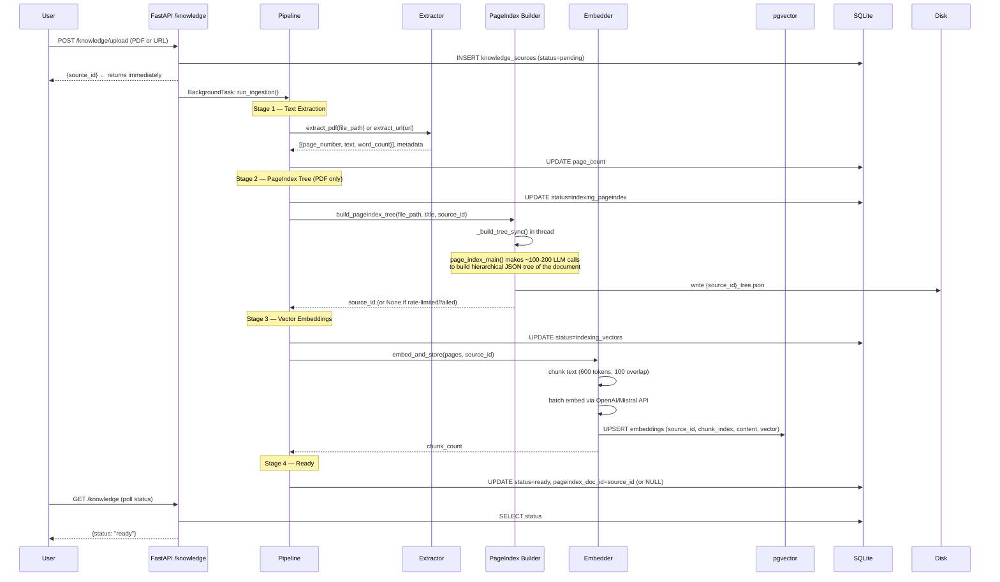
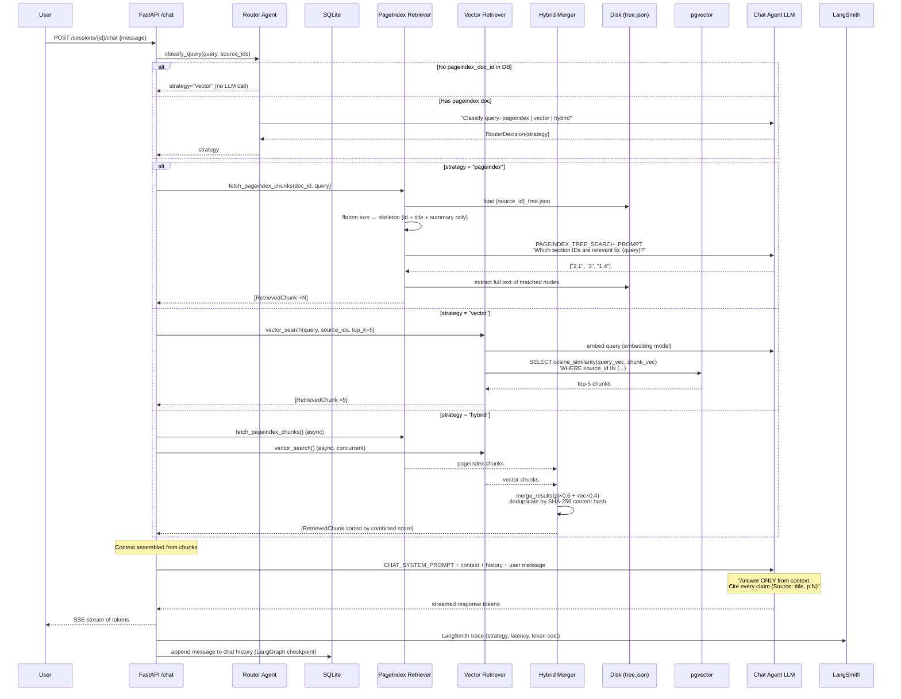
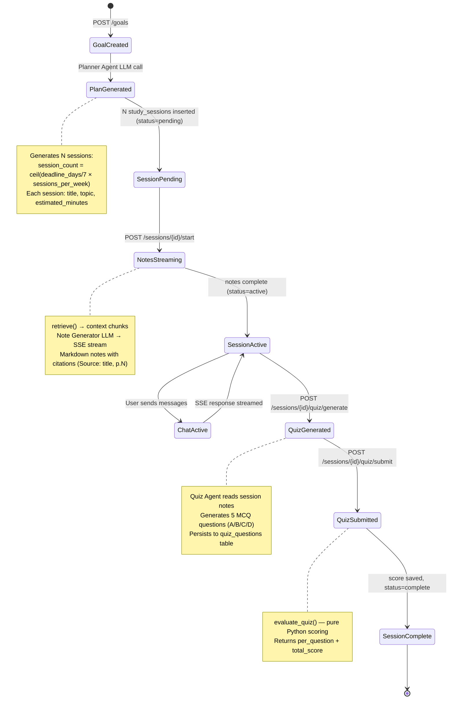

# Scholar Backend — Architecture & Flow

## Overview

Scholar is a goal-driven AI study system. Users upload textbooks, set a study goal, and work through a structured plan of sessions — each session provides AI-generated notes, grounded chat, and a quiz. The backend is built on FastAPI + LangGraph and uses a dual retrieval engine at its core.

---

## System Components

```
┌─────────────────────────────────────────────────────────────────┐
│                        Next.js Frontend                         │
│              (knowledge page · goal form · study session)       │
└───────────────────────────┬─────────────────────────────────────┘
                            │ HTTP / SSE
┌───────────────────────────▼─────────────────────────────────────┐
│                       FastAPI Backend                           │
│                                                                 │
│  ┌─────────────┐  ┌──────────────┐  ┌────────────────────────┐ │
│  │  /knowledge │  │   /goals     │  │  /sessions  /chat /quiz│ │
│  │  (upload,   │  │  (create,    │  │  (start, stream, score)│ │
│  │   list, del)│  │   list, get) │  │                        │ │
│  └──────┬──────┘  └──────┬───────┘  └──────────┬─────────────┘ │
│         │                │                      │               │
│  ┌──────▼──────┐  ┌──────▼───────┐  ┌──────────▼─────────────┐ │
│  │  Ingestion  │  │   Planner    │  │   Retrieval Engine     │ │
│  │  Pipeline   │  │   Agent      │  │   (Router + Retrievers)│ │
│  └──────┬──────┘  └──────────────┘  └──────────┬─────────────┘ │
│         │                                       │               │
│  ┌──────▼──────────────────────────────────────▼─────────────┐  │
│  │                   LangGraph Orchestrator                   │  │
│  │              (AsyncSqliteSaver checkpoint)                 │  │
│  └────────────────────────────────────────────────────────────┘  │
└─────────────────────────────────────────────────────────────────┘
         │                          │
┌────────▼──────┐          ┌────────▼───────┐
│  PostgreSQL   │          │    SQLite       │
│  + pgvector   │          │  (goals,        │
│  (embeddings) │          │   sessions,     │
└───────────────┘          │   chat history, │
                           │   source meta)  │
                           └────────────────┘
         │
┌────────▼──────┐
│  Local disk   │
│  data/uploads/│
│  *.json trees │
│  (PageIndex)  │
└───────────────┘
```

---

## Storage Split

| What | Where | Why |
|------|-------|-----|
| Vector embeddings | PostgreSQL + pgvector | Fast cosine similarity at scale |
| Source metadata, goals, sessions, chat history | SQLite | Simple, no network, LangGraph checkpoint compatible |
| PageIndex document trees | Local disk (`data/uploads/{id}_tree.json`) | JSON blobs, only read at query time — no DB needed |
| Uploaded PDFs | Local disk (`data/uploads/`) | Raw files for extraction |

---

## Flow 1 — Document Ingestion

When a user uploads a PDF or submits a URL, the API returns a source ID immediately and runs ingestion as a background task through 4 sequential stages.



### Key design decisions

- **Non-blocking**: the API returns `source_id` before any processing starts. The frontend polls status.
- **Graceful degradation**: if PageIndex fails (rate limit, no API key, bad PDF), `pageindex_doc_id` stays `NULL` and the pipeline continues to vector embedding unblocked. The source is always usable.
- **PageIndex is one-time work**: the JSON tree is saved to disk. Every chat query reads it from disk in milliseconds — no rebuild.

---

## How PageIndex Builds the Tree

PageIndex is a vectorless RAG approach. Rather than chunking text, it uses an LLM to reason about the document's structure and build a hierarchical tree.

```
PDF pages (raw text)
        │
        ▼
┌───────────────────┐
│ 1. Detect TOC     │  LLM scans first ~10 pages
│    check_toc()    │  "Is there a table of contents here?"
└────────┬──────────┘
         │
    ┌────▼────────────────────────────────┐
    │  2a. TOC with page numbers found    │  toc_transformer() — 1 LLM call
    │  2b. TOC without page numbers       │  + add_page_number_to_toc() per batch
    │  2c. No TOC at all (expensive path) │  generate_toc_init() + continue() per 20k-token window
    └────┬────────────────────────────────┘
         │
         ▼
┌──────────────────────────────────┐
│ 3. Verify every section heading  │  1 LLM call per section (concurrent)
│    verify_toc()                  │  "Does section X actually start on page N?"
└────────┬─────────────────────────┘
         │
         ▼  (if accuracy < 100%)
┌──────────────────────────────────┐
│ 4. Fix incorrect placements      │  1 LLM call per wrong section (up to 3 retries)
│    fix_incorrect_toc()           │
└────────┬─────────────────────────┘
         │
         ▼
┌──────────────────────────────────┐
│ 5. Recursively split large nodes │  Re-runs meta_processor() on any chapter
│    process_large_node_recursively│  that spans too many pages/tokens
└────────┬─────────────────────────┘
         │
         ▼
┌──────────────────────────────────┐
│ 6. Generate summaries            │  1 LLM call per node
│    generate_summaries()          │
└────────┬─────────────────────────┘
         │
         ▼
{
  "doc_name": "Biology Textbook",
  "structure": [
    { "id": "1", "title": "Chapter 1: The Cell",
      "start_index": 1, "end_index": 12,
      "summary": "Covers cell structure...",
      "nodes": [
        { "id": "1.1", "title": "1.1 Cell Membrane",
          "start_index": 3, "end_index": 6,
          "text": "The cell membrane is a phospholipid bilayer...",
          "summary": "Structure and function of the membrane" },
        { "id": "1.2", ... }
      ]
    },
    ...
  ]
}           ← saved to data/uploads/{source_id}_tree.json
```

**LLM call count for a 58-page textbook (~40 sections):**

| Step | Calls |
|------|-------|
| TOC detection | ~5 |
| Structure generation (no-TOC path) | ~4 |
| Section verification | ~40 |
| Fix incorrect sections (26% accuracy → ~30 wrong) | ~30–90 |
| Recursive large-node splits | ~20–40 |
| Summary generation | ~40 |
| **Total** | **~140–220** |

This is **one-time cost at upload**. Query time uses 1 LLM call to navigate the finished tree.

---

## Flow 2 — Chat Query (Retrieval)

Once a document is ingested, every chat message goes through the retrieval engine.



### Router strategy rules

| Query type | Strategy | Example |
|-----------|----------|---------|
| Structural / chapter navigation | `pageindex` | "What does chapter 3 cover?" |
| Semantic / factual | `vector` | "Explain photosynthesis" |
| Both combined | `hybrid` | "What does chapter 2 say about mitosis and how does it relate to meiosis?" |
| No PageIndex tree available | `vector` (fallback, no LLM call) | Any query when source has no tree |

---

## Flow 3 — Study Session Lifecycle



---

## Flow 4 — Full Request Map

```
User Action                API Route                    Internal
──────────────────────────────────────────────────────────────────
Upload PDF          →  POST /knowledge/upload       →  run_ingestion()
Submit URL          →  POST /knowledge/upload           (background)
List sources        →  GET  /knowledge              →  SQLite SELECT
Delete source       →  DELETE /knowledge/{id}       →  pgvector + SQLite + disk

Create goal         →  POST /goals                  →  Planner agent LLM
List goals          →  GET  /goals                  →  SQLite SELECT
Get goal detail     →  GET  /goals/{id}             →  goal + sessions

Start session       →  POST /sessions/{id}/start    →  retrieve() + NoteGen SSE
Send chat           →  POST /sessions/{id}/chat     →  Router → retrieve() → ChatAgent SSE
Generate quiz       →  POST /sessions/{id}/quiz/generate  →  Quiz agent LLM
Submit quiz         →  POST /sessions/{id}/quiz/submit    →  evaluate_quiz() pure Python

Health check        →  GET  /health                 →  pgvector ping
```

---

## LLM Call Summary

| Operation | LLM Calls | Notes |
|-----------|-----------|-------|
| Upload PDF (PageIndex tree build) | 140–220 | One-time, at ingestion |
| Upload PDF (vector embeddings) | 1 embedding call per ~20 chunks | Embedding model, not chat LLM |
| Create goal (planner) | 1 | Structured output |
| Start session (notes) | 1+ streaming | Depends on context length |
| Chat message | 2 | 1 router + 1 chat |
| Chat message (vector-only) | 1 | Router skipped (no PageIndex) |
| Chat message (hybrid) | 2 | Router + chat |
| PageIndex query navigation | 1 | Tree skeleton → node IDs |
| Generate quiz | 1 | Structured output, 5 questions |
| Submit quiz | 0 | Pure Python scoring |

---

## LLM Provider Configuration

Scholar uses a single `LLM_*` env var set for all LLM calls (chat, router, planner, quiz) and a separate `EMBEDDING_*` set for embeddings. The `llm_base_url` flag enables any OpenAI-compatible provider:

```
LLM_API_KEY=...
LLM_BASE_URL=https://api.mistral.ai/v1   # empty = use OpenAI
LLM_MODEL=mistral-small-latest

EMBEDDING_API_KEY=...
EMBEDDING_BASE_URL=https://api.mistral.ai/v1
EMBEDDING_MODEL=mistral-embed
EMBEDDING_DIMENSIONS=1024
```

PageIndex uses the same `LLM_*` settings (set via `OPENAI_API_KEY` env var + `litellm.api_base`) so no separate key is needed.

---

## Dual Retrieval: PageIndex vs Vector

```
                    User Query
                        │
              ┌─────────▼──────────┐
              │    Router Agent    │
              │  (1 LLM call)      │
              └──┬──────┬──────┬───┘
                 │      │      │
           pageindex  vector  hybrid
                 │      │      │
    ┌────────────▼─┐  ┌─▼──────┐  ┌──▼──────────────────┐
    │  PageIndex   │  │Vector  │  │ Both concurrently    │
    │  Retriever   │  │Retriever│  │ then merge(0.6/0.4) │
    └──────┬───────┘  └─┬──────┘  └──────────┬──────────┘
           │            │                     │
    ┌──────▼──────┐  ┌──▼──────┐             │
    │ Load tree   │  │Embed    │             │
    │ from disk   │  │query    │             │
    │             │  │         │             │
    │ Flatten to  │  │cosine   │             │
    │ skeleton    │  │search   │             │
    │             │  │pgvector │             │
    │ LLM picks   │  └─────────┘             │
    │ node IDs    │                          │
    │             │                          │
    │ Extract     │                          │
    │ section text│                          │
    └──────┬──────┘                          │
           └────────────────┬────────────────┘
                            │
                    [RetrievedChunk list]
                    source_id, source_title,
                    content, page_number,
                    section_title, relevance_score

```

| | PageIndex | Vector RAG |
|---|---|---|
| **Retrieval unit** | Whole document section | Fixed-size text chunk (600 tokens) |
| **Finding method** | LLM reads section titles+summaries, picks relevant ones | Cosine similarity between query embedding and chunk embeddings |
| **Best for** | "Explain Chapter 3", structural questions, long-form context | "What is X?", factual lookups, cross-document search |
| **Index time** | High (100-200 LLM calls) | Low (embedding API calls only) |
| **Query time** | 1 LLM call (tree navigation) | 0 LLM calls (math only) |
| **Requires** | LLM during ingestion | Embedding model |
| **Storage** | JSON file on disk | pgvector rows |
