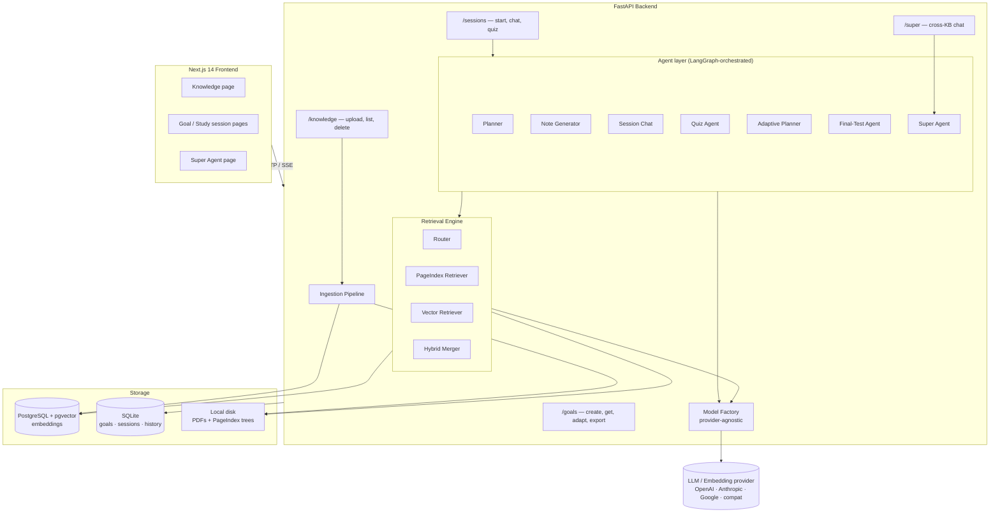
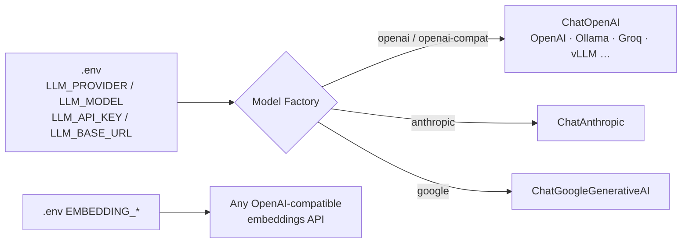

# Architecture

Scholar is a goal-driven AI study system: upload textbooks, set a deadline, and work through a generated plan of sessions — each with AI notes, grounded chat, and a quiz. The backend is **FastAPI + LangGraph** over a **dual retrieval engine**; the frontend is **Next.js 14**.

---

## System Components



### The agent layer

All learning logic is implemented as agents that share the retrieval engine and the model factory. Conversational agents (chat, super) persist their history through a **LangGraph `AsyncSqliteSaver` checkpointer**, so a browser refresh never loses context.

| Agent | Trigger | Job |
|-------|---------|-----|
| **Planner** | `POST /goals` | Turn a goal (topic, level, deadline) into N ordered sessions. |
| **Note Generator** | `POST /sessions/{id}/start` | Retrieve context, stream cited markdown notes, persist them. |
| **Session Chat** | `POST /sessions/{id}/chat` | Grounded Q&A for one session; history checkpointed per goal. |
| **Quiz Agent** | `POST /sessions/{id}/quiz/generate` | Generate MCQs from the session notes; pure-Python scoring on submit. |
| **Adaptive Planner** | quiz submit (score < 65%) | Insert a targeted remedial session and renumber the plan atomically. |
| **Final-Test Agent** | `POST /goals/{id}/test/generate` | Build a cumulative cross-session exam; ≥ 70% marks the goal complete. |
| **Super Agent** | `POST /super/chat/stream` | One chat grounded across **all** ready sources via a persistent `thread_id`. |

---

## Storage Model

Scholar deliberately splits state across three stores, each chosen for its access pattern:

| What | Where | Why |
|------|-------|-----|
| Vector embeddings | **PostgreSQL + pgvector** | Fast cosine similarity at scale; the only piece that needs a real DB. |
| Goals, sessions, notes, quiz data, chat history | **SQLite** | Simple, embedded, and directly compatible with the LangGraph checkpointer. |
| PageIndex document trees | **Local disk** (`data/uploads/{id}_tree.json`) | Read-only JSON blobs loaded at query time — no DB row needed. |
| Uploaded PDFs | **Local disk** (`data/uploads/`) | Raw files for text/vision extraction. |

---

## Retrieval Engine (summary)

Every grounded answer flows through the engine. A **router** classifies each query and dispatches to one of three strategies:

- **`pageindex`** — an LLM navigates a hierarchical tree of the document and returns whole sections. Best for structural/"what does the chapter on X say" questions.
- **`vector`** — cosine similarity over 600-token chunks in pgvector. Best for factual lookups and cross-book search. Also the automatic fallback when a source has no tree.
- **`hybrid`** — runs both concurrently and merges (`0.6 × PageIndex + 0.4 × vector`), de-duplicating by content hash.

Full design, including the bug that once silently disabled PageIndex retrieval, is in **[retrieval.md](retrieval.md)**.

---

## Model-Agnostic by Design

No model name is hardcoded anywhere in the application. A single **model factory** (`app/llm_factory.py`) builds the right client from `.env`:



Chat, planner, quiz, notes, router, the PageIndex navigation LLM, vision, **and** the RAGAS evaluation judge + embeddings all read from this configuration. See **[configuration.md](configuration.md)**.

---

## Request Map

```
User action            API route                              Internal
──────────────────────────────────────────────────────────────────────────────
Upload PDF / URL    →  POST   /knowledge/upload            →  run_ingestion() (background)
List / delete       →  GET    /knowledge  · DELETE /{id}   →  SQLite + pgvector + disk

Create goal         →  POST   /goals                       →  Planner agent
Get goal + plan     →  GET    /goals/{id}                  →  goal + sessions
Manual adapt        →  POST   /goals/{id}/adapt            →  Adaptive Planner
Export to Notion    →  POST   /goals/{id}/export/notion    →  Notion export (background)
Final test          →  POST   /goals/{id}/test/generate    →  Final-Test agent
                       POST   /goals/{id}/test/submit      →  score → goal complete

Start session       →  POST   /sessions/{id}/start         →  retrieve() + Note Generator (SSE)
Get session         →  GET    /sessions/{id}               →  SQLite SELECT
Send chat           →  POST   /sessions/{id}/chat          →  Router → retrieve() → Chat (SSE)
Generate / submit   →  POST   /sessions/{id}/quiz/*        →  Quiz agent · pure-Python scoring
                                                              (submit may trigger Adaptive Planner)

Super chat          →  POST   /super/chat/stream           →  Super Agent across all sources (SSE)
Health              →  GET    /health                      →  pgvector ping
```

---

## Cross-Cutting Concerns

- **Streaming** — notes, chat, and super-chat stream via Server-Sent Events (`text/event-stream`), parsed by a small native client in the frontend. No EventSource library.
- **Graceful degradation** — if PageIndex tree-building fails, ingestion still completes vector-only and the source stays usable.
- **Observability** — when `LANGCHAIN_API_KEY` is set, every agent call is traced in LangSmith (strategy, latency, token cost); absent the key, tracing is a silent no-op.
- **Security** — the chat system prompt enforces "answer only from the provided context"; secrets live only in `.env` (gitignored); CORS is restricted to localhost origins.
- **Resilience** — per-request timeouts and limited retries on LLM calls; SSE generators emit an `error` event (and log) on failure instead of dying silently.
