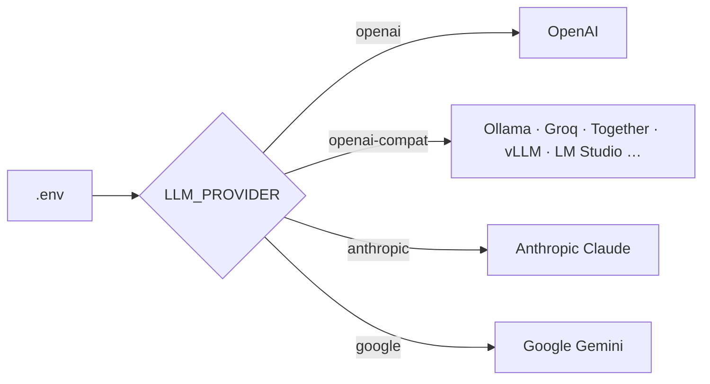

# Configuration

Scholar is configured entirely through environment variables (`.env`). Nothing about a model or provider is hardcoded — the same build runs on OpenAI, Anthropic, Google, or any OpenAI-compatible endpoint by changing `.env` alone.

Copy `.env.example` to `.env` and fill in the values below.

---

## Model-agnostic by design

A single **model factory** (`backend/app/llm_factory.py`) constructs the LLM client for every call — chat, planner, notes, quiz, router, final test, super agent, PageIndex navigation, and the RAGAS evaluation judge. Embeddings (ingestion, query, and evaluation) go through a parallel OpenAI-compatible client. Change the provider in one place and it applies everywhere.



---

## LLM (chat / agents)

| Variable | Default | Purpose |
|----------|---------|---------|
| `LLM_PROVIDER` | `openai` | `openai` · `openai-compat` · `anthropic` · `google` |
| `LLM_MODEL` | `gpt-4o-mini` | Model name for the chosen provider |
| `LLM_API_KEY` | — | Provider key (falls back to `OPENAI_API_KEY` if empty) |
| `LLM_BASE_URL` | — | For `openai-compat` — point at any OpenAI-compatible host |
| `LLM_TIMEOUT_SECONDS` | `60` | Per-request timeout so a hung provider can't stall a stream |

**Examples**

```bash
# OpenAI (default)
LLM_PROVIDER=openai
LLM_MODEL=gpt-4o-mini
OPENAI_API_KEY=sk-...

# Anthropic Claude   (pip install langchain-anthropic)
LLM_PROVIDER=anthropic
LLM_MODEL=claude-3-5-sonnet-20241022
LLM_API_KEY=sk-ant-...

# Google Gemini      (pip install langchain-google-genai)
LLM_PROVIDER=google
LLM_MODEL=gemini-2.0-flash
LLM_API_KEY=AIza...

# Local Ollama (OpenAI-compatible)
LLM_PROVIDER=openai-compat
LLM_BASE_URL=http://localhost:11434/v1
LLM_MODEL=llama3.2
LLM_API_KEY=ollama
```

> `anthropic` and `google` providers require their optional LangChain packages; the factory raises a clear install hint if they're missing.

---

## Retrieval strategy

Scholar's dual engine is selected by a single variable — the same checkout runs as hybrid, PageIndex-only, or vector-only.

| Variable | Default | Values |
|----------|---------|--------|
| `RETRIEVAL_STRATEGY` | `auto` | `auto` · `hybrid` · `pageindex` · `vector` |

- **`auto`** — a per-query router (1 LLM call) picks the best strategy for each question. The smart default.
- **`hybrid`** — always run PageIndex **and** vector, then merge (`0.6 × PageIndex + 0.4 × vector`).
- **`pageindex`** — always use PageIndex structural retrieval.
- **`vector`** — always use vector semantic retrieval.

Forcing a strategy skips the router LLM call. See [retrieval.md](retrieval.md) for how each works and [evaluation.md](evaluation.md) for how they compare.

---

## Embeddings

Any OpenAI-compatible embeddings API. Used for ingestion, query-time vector search, **and** the RAGAS evaluation embeddings.

| Variable | Default | Purpose |
|----------|---------|---------|
| `EMBEDDING_MODEL` | `text-embedding-3-small` | Embedding model |
| `EMBEDDING_API_KEY` | — | Falls back to `OPENAI_API_KEY` |
| `EMBEDDING_BASE_URL` | — | OpenAI-compatible host (e.g. Ollama) |
| `EMBEDDING_DIMENSIONS` | `1536` | **Must** match the model (e.g. `nomic-embed-text` = 768). The pgvector column is created at this width — changing it requires a fresh vector store. |

---

## Vision (optional, multimodal ingestion)

| Variable | Default | Purpose |
|----------|---------|---------|
| `VISION_MODEL` | — (disabled) | Set to a vision-capable model (e.g. `gpt-4o-mini`) to extract descriptions of diagrams/figures during ingestion |
| `VISION_MAX_PAGES` | `20` | Cost guard — max pages per document to send to the vision model (`0` = unlimited) |

Empty `VISION_MODEL` means vision is off and ingestion is unaffected.

---

## Notion export (optional)

| Variable | Purpose |
|----------|---------|
| `NOTION_API_KEY` | Bearer token from a Notion integration |
| `NOTION_PARENT_PAGE_ID` | Page under which goal pages are created |

Both must be set for export to be enabled.

---

## PageIndex

PageIndex is the open-source library, run locally — **no separate key**. It reuses the `LLM_*` settings (via `OPENAI_API_KEY` + `litellm.api_base`). In Docker it's cloned into the image; for local non-Docker runs, clone `VectifyAI/PageIndex` and add it to `PYTHONPATH`.

---

## Observability (optional)

| Variable | Purpose |
|----------|---------|
| `LANGCHAIN_API_KEY` | Enables LangSmith tracing of every agent call (strategy, latency, cost) |
| `LANGCHAIN_TRACING_V2` | `true` to trace |
| `LANGCHAIN_PROJECT` | LangSmith project name |

Absent the key, tracing is a silent no-op.

---

## Infrastructure

| Variable | Purpose |
|----------|---------|
| `DATABASE_URL` | PostgreSQL + pgvector DSN (Docker wires this automatically) |
| `POSTGRES_PASSWORD` | DB password used by `docker-compose` |
| `SQLITE_PATH` | Path to the SQLite file (goals, sessions, history) |
| `UPLOAD_DIR` | Where PDFs and PageIndex trees are stored |
| `NEXT_PUBLIC_API_URL` | Where the frontend's `/api` proxy forwards (in Docker: `http://backend:8000`) |
