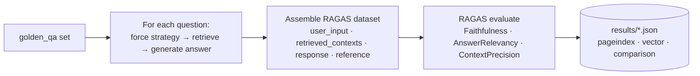

# Evaluation

Scholar's two retrieval strategies are benchmarked head-to-head with **[RAGAS](https://docs.ragas.io)**. This document covers the methodology, the evaluation book, the golden Q&A set, the latest results, and how to reproduce them.

The runner lives at `backend/eval/run_ragas.py`; results are committed under `backend/eval/results/`.

---

## The evaluation book

The original golden set (`backend/eval/golden_qa.json`, 30 Q&A) targets **OpenStax Biology 2e**. That book is **not bundled** with the repository (it's a ~1,500-page, >50 MB textbook — impractical to ship and to tree-index).

What ships and is used by default is a **58-page Environmental Science textbook** — _"OAI551 — Environment and Agriculture"_ — covering ecosystems, biodiversity, climate change, and agricultural impact. It has a clear unit/section structure, which is exactly what exercises PageIndex's structural navigation.

Because that book ≠ Biology, a **matching golden set was generated for it**: `backend/eval/golden_qa_envsci.json` — 30 questions (15 structural "deep" + 15 factual), each with a model-written `ground_truth` grounded in the book's content. This makes all three RAGAS metrics meaningful.

> To benchmark against Biology 2e instead, supply the PDF and run with `--golden-qa eval/golden_qa.json`.

---

## Metrics

| Metric | Question it answers | Needs |
|--------|---------------------|-------|
| **Faithfulness** | Does the answer only make claims supported by the retrieved context? (no hallucination) | Judge LLM |
| **Answer Relevancy** | Is the answer actually on-topic for the question? | Judge LLM + embeddings |
| **Context Precision** | Were the retrieved chunks the *right* ones for the reference answer? | Judge LLM + embeddings |

Both the judge LLM and the embeddings used by RAGAS are configured from the **same env vars** the app uses (`LLM_*`, `EMBEDDING_*`), so the evaluation is as provider-agnostic as the app — see [configuration.md](configuration.md).

---

## How a run works



The runner deliberately **bypasses the router** and forces each strategy in turn, so the comparison is apples-to-apples.

---

## Latest results

All three strategies, 30 Q&A, OpenAI judge, over the fully-ingested Environmental Science book with its matching golden set:

| Strategy | Faithfulness | Answer Relevancy | Context Precision | Avg Latency |
|----------|:-----------:|:----------------:|:-----------------:|:-----------:|
| **PageIndex** | **0.94** | 0.81 | 0.77 | 2480 ms |
| **Vector** | 0.85 | **0.91** | **0.92** | 1780 ms |
| **Hybrid** | **0.94** | 0.90 | 0.90 | 2157 ms |

**Reading the result:**

- **PageIndex wins faithfulness** — returning whole, coherent sections gives the LLM more surrounding context to stay grounded in — but loses on precision, because those sections also drag in unrelated material.
- **Vector wins relevancy + precision** — semantic chunk search returns tighter, more on-point passages, with less noise — and is ~700 ms faster (no LLM tree-navigation step).
- **Hybrid gets the best of both** — it merges the two (`0.6 × PageIndex + 0.4 × vector`), inheriting PageIndex's grounding **and** near-Vector precision (0.94 / 0.90 / 0.90). This is the empirical case for shipping `hybrid` (or `auto`) as the default strategy.

> An earlier run scored PageIndex's relevancy/precision near zero — that was the silently-broken retrieval described in [retrieval.md](retrieval.md), not a property of the approach.

The full machine-readable record is `backend/eval/results/comparison_3way.json`. Switch strategies at runtime with `RETRIEVAL_STRATEGY` ([configuration.md](configuration.md)).

---

## Reproducing

```bash
# All three strategies against the bundled book + its matching golden set:
docker compose exec backend python eval/run_ragas.py \
  --book-path /app/data/uploads/<your-source>.pdf \
  --golden-qa eval/golden_qa_envsci.json \
  --strategy all \
  --output-dir eval/results/

# Just one strategy (e.g. only hybrid): --strategy hybrid
# A subset:                            --strategy pageindex,vector

# Against OpenStax Biology 2e (supply the PDF) with the original golden set:
docker compose exec backend python eval/run_ragas.py \
  --book-path /app/data/uploads/biology2e.pdf \
  --golden-qa eval/golden_qa.json \
  --output-dir eval/results/
```

Requirements for representative scores: the book must be **ingested** (pgvector populated **and** a PageIndex tree built), and the judge/embedding provider keys must be set. `--dry-run` skips the RAGAS call and writes mock scores for plumbing tests.

### Generating a golden set for a new book

`golden_qa_envsci.json` was produced by reading the book's text in windows and asking the configured LLM for grounded question/answer pairs (a mix of structural and factual), then balancing to 30. Any book can get the same treatment — the only schema requirement the runner enforces is `id`, `question`, and `ground_truth` per item.
