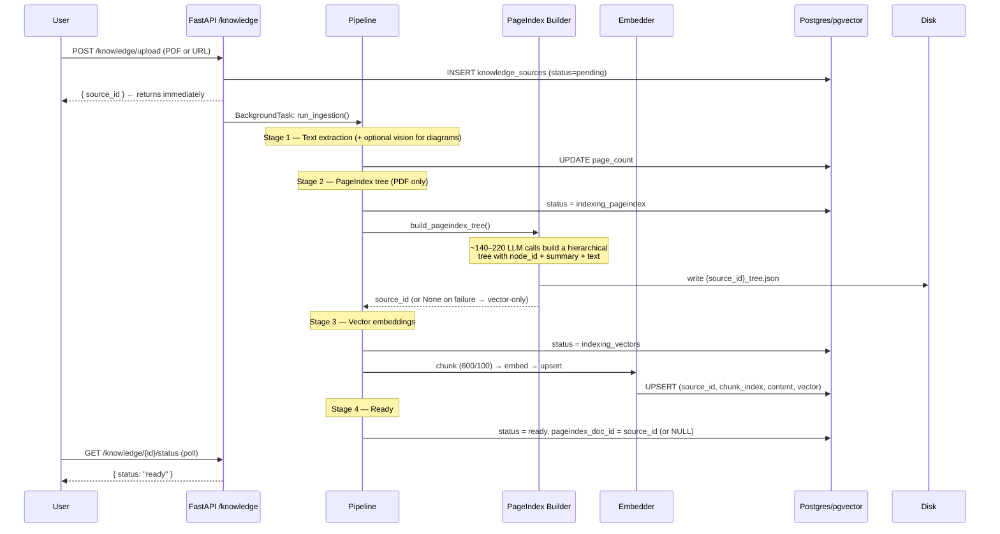
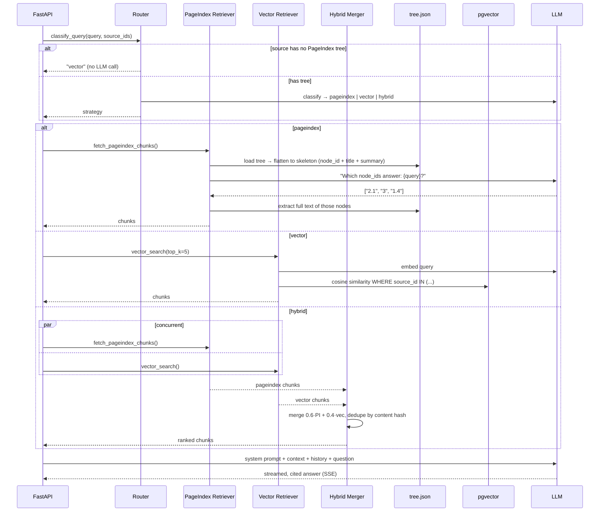
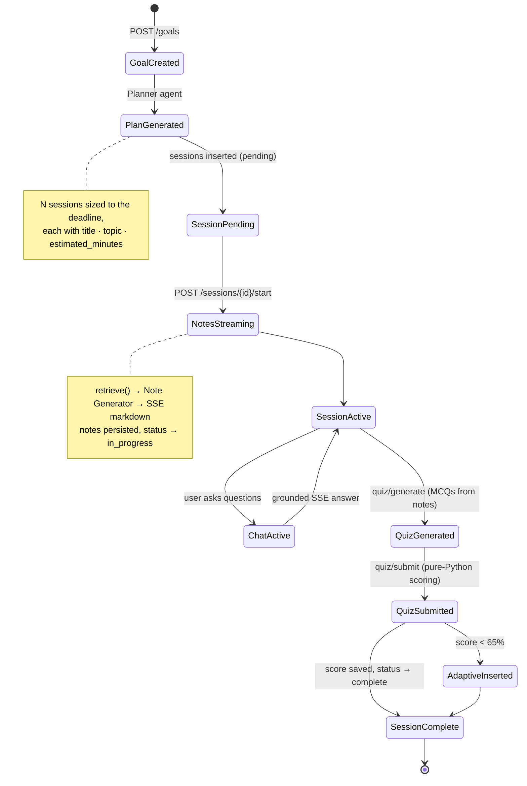
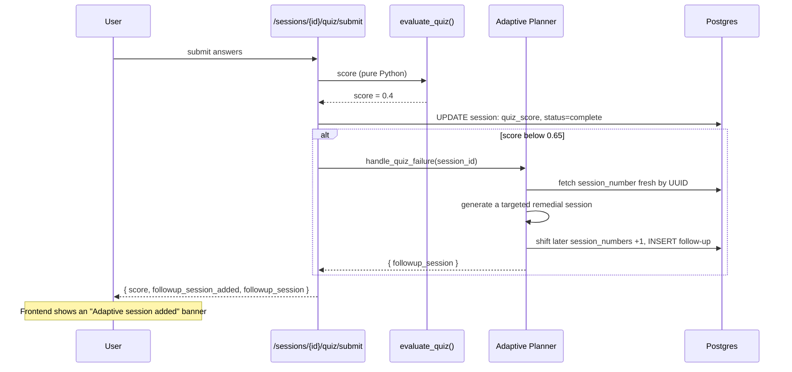
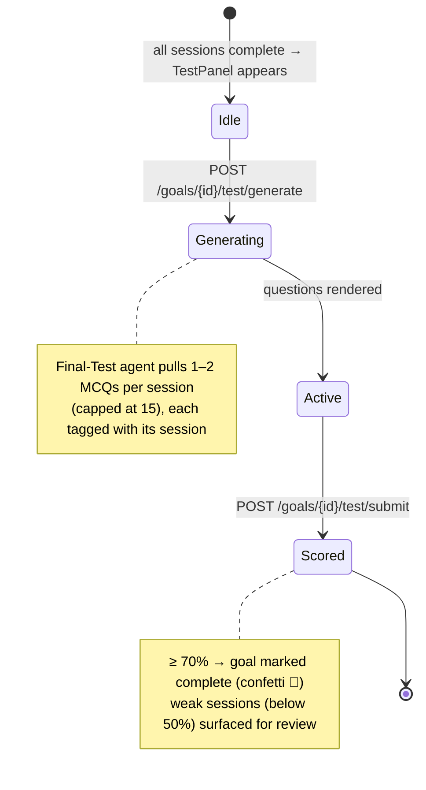
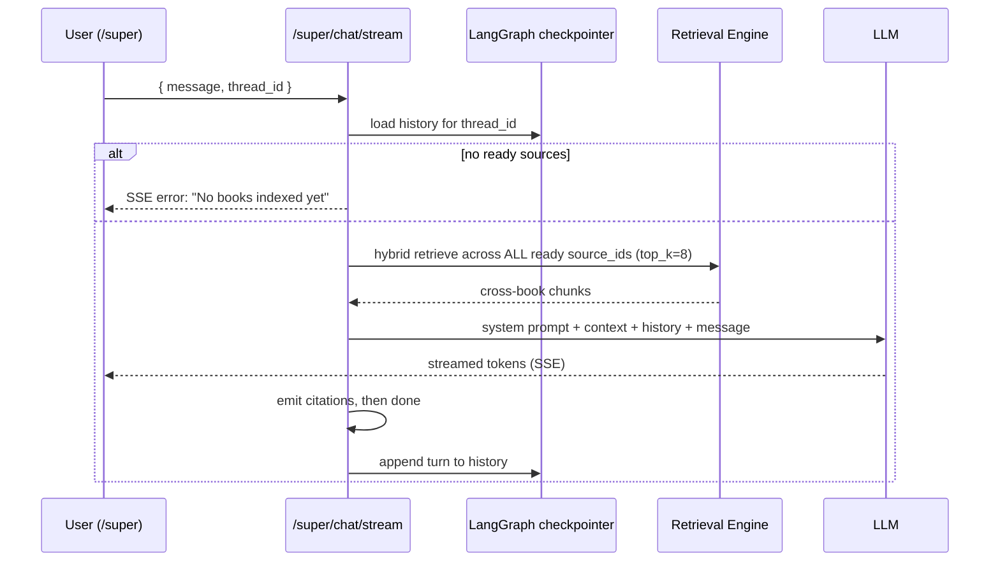

# Flows

Every important Scholar flow as a diagram. For component context, see [architecture.md](architecture.md).

---

## 1 — Document Ingestion

Upload returns a `source_id` immediately; processing runs as a background task through four stages. PageIndex tree-building is the expensive step and degrades gracefully on failure.

---

## 2 — Retrieval Routing (the grounded-answer path)

Every note and chat message runs through the router, which picks a strategy and dispatches to the retrievers.

---

## 3 — Study Session Lifecycle

---

## 4 — Adaptive Follow-up (score < 65%)

When a quiz is failed, the adaptive planner inserts a remedial session **after** the current one and renumbers the rest — atomically, so a second failure can't corrupt the order.

---

## 5 — Final Cumulative Test

Available once every session is complete. Questions are drawn across sessions; passing marks the whole goal complete.

---

## 6 — Super Agent (cross-knowledge-base chat)

A single chat grounded across **all** ready sources, with history keyed by a client-owned `thread_id` (from `localStorage`) so it persists across visits.

