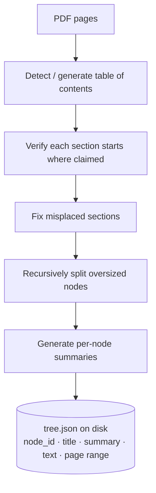

# Dual Retrieval Engine

Scholar's defining design choice is running **two complementary retrievers** and routing each query to the right one. This document explains both, how they're combined, and how they compare.

For measured results, see **[evaluation.md](evaluation.md)**.

---

## Why two retrievers?

A single strategy leaves gaps:

- **Vector RAG** excels at "what is X?" factual lookups but chops documents into fixed 600-token chunks, losing structure. Ask "summarise the chapter on ecological diversity" and it returns scattered fragments.
- **PageIndex** preserves document structure — it can hand the LLM a whole coherent section — but it relies on an LLM to navigate, costing latency and sometimes missing a precise fact buried mid-section.

Scholar keeps both and lets a router choose.

---

## PageIndex (structural, vectorless)

PageIndex builds a **hierarchical tree** of the document once, at ingestion. Rather than chunking, an LLM reasons about the document's structure (table of contents, sections, page ranges) and produces a JSON tree where each node carries a `node_id`, `title`, `summary`, page range, and the section `text`.



A 58-page textbook costs roughly **140–220 LLM calls** to index — paid **once**. The tree is a JSON file on disk; no database row.

**At query time** (one LLM call): the tree is flattened to a compact skeleton of `node_id + title + summary`, the LLM is asked which node IDs answer the query, and the full text of those nodes is returned.

> ### ⚠️ A bug worth documenting
> PageIndex retrieval was historically **silently broken**, returning zero chunks for nearly every query — so the head-to-head comparison was meaningless. Two causes: (1) the builder set the library's options to Python `True`, but the open-source library checks them against the **string** `'yes'`, so `node_id`/`summary`/`text` were never written to the tree; (2) the retriever read a `node.id` field while the library writes `node_id`. Both are fixed; trees built before the fix must be rebuilt (re-ingest the source).

---

## Vector (semantic)

Standard embedding retrieval:

1. Text is chunked at **600 tokens with 100 overlap** during ingestion and embedded via the configured embeddings API.
2. Vectors are upserted into **pgvector**.
3. At query time the query is embedded and ranked by **cosine similarity**, scoped to the relevant `source_id`s, returning the top `k` chunks.

Zero LLM calls at query time (pure vector math) and it works for **any** source — making it the universal fallback when a document has no PageIndex tree.

---

## The Router

A lightweight classifier picks the strategy per query. If the source has **no** tree it short-circuits to `vector` with no LLM call; otherwise one structured-output call returns the decision.

| Query type | Strategy | Example |
|-----------|----------|---------|
| Structural / navigational | `pageindex` | "What does the unit on climate change cover?" |
| Factual / semantic | `vector` | "Define genetic diversity." |
| Mixed | `hybrid` | "How does Unit III define water scarcity and how does it relate to agriculture?" |
| No tree available | `vector` (fallback, no LLM) | any query on a vector-only source |

---

## Hybrid Merge

For `hybrid`, both retrievers run **concurrently**, then results are merged by weighted score and de-duplicated by a content hash:

```
combined_score = 0.6 × pageindex_score + 0.4 × vector_score
```

The 0.6/0.4 weighting favors PageIndex's structural coherence while letting vector hits surface precise facts the section-level retrieval might dilute.

---

## Side-by-side

| | PageIndex | Vector RAG |
|---|---|---|
| **Retrieval unit** | Whole document section | Fixed 600-token chunk |
| **How it finds context** | LLM reads titles + summaries, picks node IDs | Cosine similarity over embeddings |
| **Best for** | Structural / long-form / "the chapter on …" | Factual lookups, cross-book search |
| **Index-time cost** | High (~140–220 LLM calls, one-time) | Low (embedding calls only) |
| **Query-time cost** | 1 LLM call (tree navigation) | 0 LLM calls |
| **Storage** | JSON tree on disk | pgvector rows |
| **Measured strength** | Higher **faithfulness** | Higher **answer relevancy + context precision** |

The "measured strength" row is quantified in **[evaluation.md](evaluation.md)**.
