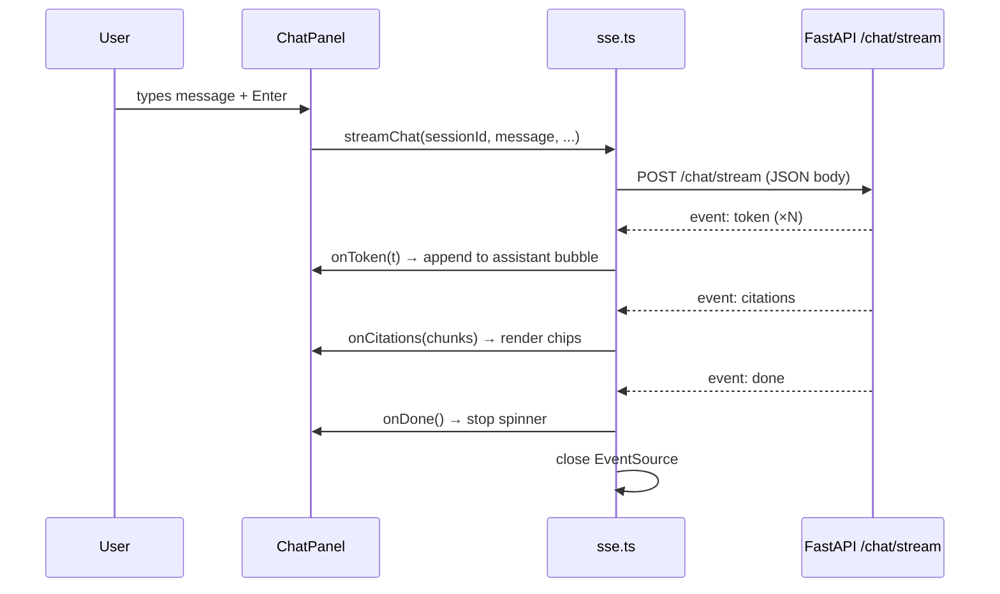
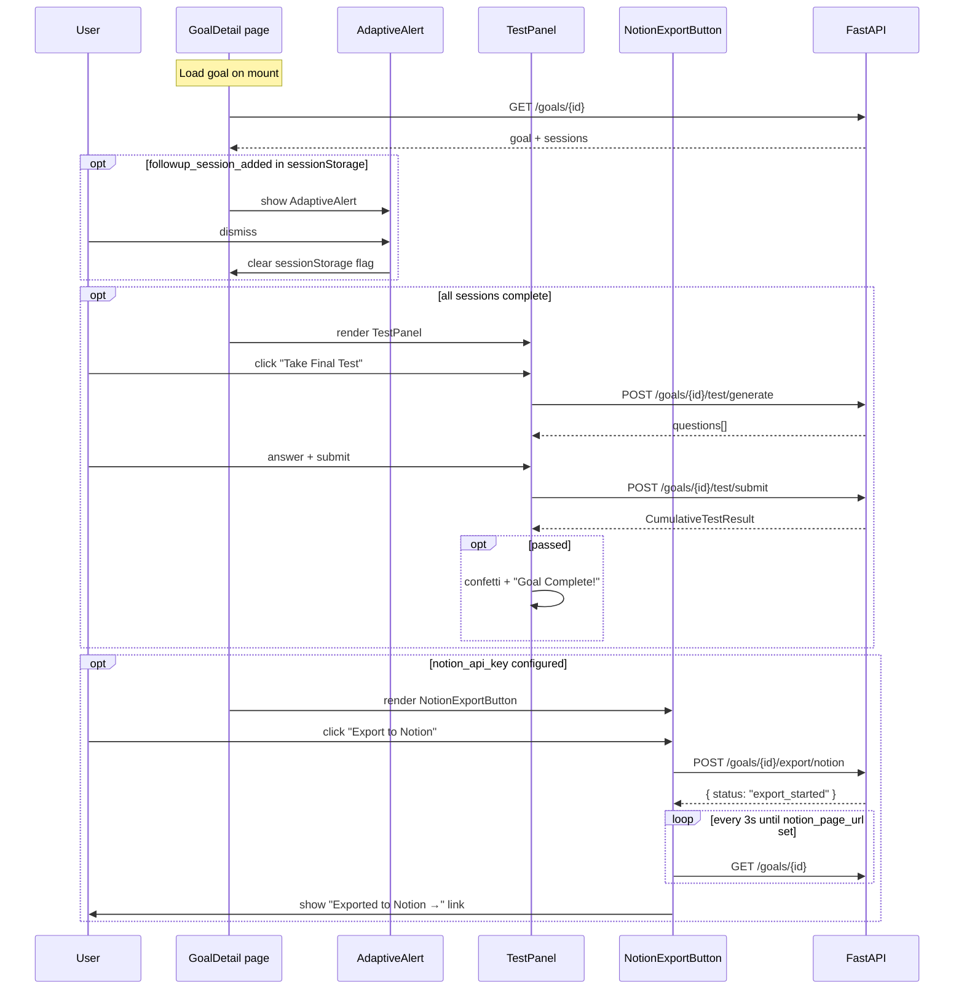

# Frontend — Scholar Next.js App

Next.js 14 (App Router) frontend for Scholar. All pages are client components that communicate with the FastAPI backend via REST and Server-Sent Events (SSE).

---

## Quick Start

```bash
cd frontend
npm install
npm run dev          # http://localhost:3000
```

Or via Docker Compose from the repo root:
```bash
docker compose up frontend
```

Set `NEXT_PUBLIC_API_URL` in your environment if the backend is not at `http://localhost:8000`:
```env
NEXT_PUBLIC_API_URL=http://localhost:8000
```

---

## Pages

| Route | File | Description |
|-------|------|-------------|
| `/` | `app/page.tsx` | Redirects to `/knowledge` |
| `/knowledge` | `app/knowledge/page.tsx` | Upload PDFs or URLs; poll ingestion status |
| `/goals/new` | `app/goals/new/page.tsx` | Create a study goal |
| `/goals/[id]` | `app/goals/[id]/page.tsx` | Goal detail: sessions, progress, test, Notion export |
| `/study/[sessionId]` | `app/study/[sessionId]/page.tsx` | 3-panel study view: notes / chat / quiz |
| `/super` | `app/super/page.tsx` | Super Agent: cross-KB persistent chat |

---

## Page Flow

```mermaid
flowchart LR
    KB[/knowledge\nUpload books] --> GN[/goals/new\nSet goal]
    GN --> GD[/goals/id\nGoal detail + plan]
    GD --> SS[/study/sessionId\nStudy session]
    SS -->|quiz complete| GD
    GD -->|all sessions done| TEST[Final test panel]
    TEST -->|pass| DONE[Goal complete 🎉]
    KB -.-> SUPER[/super\nSuper Agent]
```

---

## Component Map

### Core (V1)

| Component | Purpose |
|-----------|---------|
| `KnowledgeUpload.tsx` | react-dropzone PDF upload + URL field; polls `/knowledge/{id}/status` every 3 s |
| `GoalForm.tsx` | Controlled form: title, topic, level, deadline, sessions/week, multi-source selector |
| `StudyPlan.tsx` | Session card list with status pills (locked / available / in-progress / complete + score badge) |
| `SessionNotes.tsx` | Renders streaming markdown notes with citation footnote links |
| `ChatPanel.tsx` | SSE chat with token streaming; citation chips below each assistant message |
| `QuizPanel.tsx` | MCQ one at a time → submit all → per-question results with explanations |
| `ProgressBar.tsx` | Animated bar showing `completed / total` sessions |

### V2 Additions

| Component | Purpose |
|-----------|---------|
| `AdaptiveAlert.tsx` | Dismissible amber banner shown when `followup_session_added=true` after quiz |
| `TestPanel.tsx` | Final cumulative test: "Take Final Test" → MCQ → confetti on pass |
| `NotionExportButton.tsx` | Triggers export; polls `GET /goals/{id}` for `notion_page_url`; shows link on success |

---

## SSE Streaming Pattern

All streaming endpoints use Server-Sent Events. The `sse.ts` helper provides a consistent interface:

```typescript
// lib/sse.ts — session chat
export function streamChat(
  sessionId: string,
  message: string,
  chatHistory: ChatMessage[],
  onToken: (t: string) => void,
  onCitations: (c: RetrievedChunk[]) => void,
  onDone: (meta: { strategy_used: string; latency_ms: number }) => void,
  onError: (msg: string) => void,
): () => void   // returns cancel function

// lib/sse.ts — super agent
export function streamSuperChat(
  message: string,
  threadId: string,
  onToken: ...,
  onDone: ...,
  onError: ...,
): () => void
```

### SSE Event Types

| Event | Payload | Used in |
|-------|---------|---------|
| `token` | `{ type: "token", content: string }` | chat, super, notes |
| `citations` | `{ type: "citations", chunks: RetrievedChunk[] }` | chat, super |
| `done` | `{ type: "done", strategy_used, latency_ms }` | chat, super |
| `notes_chunk` | `{ type: "notes_chunk", content: string }` | session start |
| `notes_done` | `{ type: "notes_done", total_chars: number }` | session start |
| `error` | `{ type: "error", content: string }` | all |

### Sequence: Chat Message



---

## Super Agent Page (`/super`)

The Super Agent maintains chat history across browser sessions via a `thread_id` stored in `localStorage`:

```typescript
// Generated once per browser, never regenerated
const threadId = localStorage.getItem('scholar_super_thread_id')
  ?? (() => {
    const id = crypto.randomUUID()
    localStorage.setItem('scholar_super_thread_id', id)
    return id
  })()
```

This `thread_id` is sent with every request. The backend uses it as the LangGraph checkpoint key — the server **never** generates or overrides it.

---

## Goal Detail Page — V2 Component Interactions



---

## Type Definitions (`src/types/index.ts`)

Key types used across the app:

```typescript
interface KnowledgeSource {
  id: string; title: string; source_type: 'pdf' | 'url'
  status: 'pending' | 'indexing_pageindex' | 'indexing_vectors' | 'ready' | 'failed'
  page_count: number; pageindex_doc_id: string | null
}

interface StudyGoal {
  id: string; title: string; topic: string; level: string
  status: 'active' | 'complete'; deadline_days: number
}

interface StudySession {
  id: string; goal_id: string; session_number: number; title: string
  status: 'pending' | 'in_progress' | 'complete'
  quiz_score: number | null; notes_markdown: string | null
}

interface RetrievedChunk {
  source_title: string; page_number: number | null
  content: string; relevance_score: number; retrieval_method: string
}

interface TestQuestion { id: string; question: string; options: string[] }
interface TestResult {
  score: number; passed: boolean; goal_complete: boolean
  weak_session_numbers: number[]
}
```

---

## API Client (`src/lib/api.ts`)

All REST calls go through `api.ts`. Base URL from `NEXT_PUBLIC_API_URL`:

```typescript
// Knowledge
listSources(): Promise<KnowledgeSource[]>
uploadFile(file: File): Promise<{ source_id: string }>
uploadUrl(url: string): Promise<{ source_id: string }>
getSourceStatus(id: string): Promise<{ status: string }>

// Goals
createGoal(data): Promise<{ goal_id: string }>
getGoal(id: string): Promise<{ goal: StudyGoal; sessions: StudySession[] }>
adaptGoal(goalId: string): Promise<{ followup_added: boolean }>
exportToNotion(goalId: string): Promise<{ status: string }>

// Sessions
startSession(id: string): via SSE streamNotes()
generateQuiz(sessionId: string): Promise<QuizQuestion[]>
submitQuiz(sessionId, answers): Promise<QuizResult>

// Final test
generateFinalTest(goalId): Promise<TestQuestion[]>
submitFinalTest(goalId, answers): Promise<TestResult>
```

---

## Navigation

All pages share a sidebar with links to:
- `/knowledge` — Knowledge Base
- `/goals/new` — New Goal
- `/super` — Super Agent (V2)
